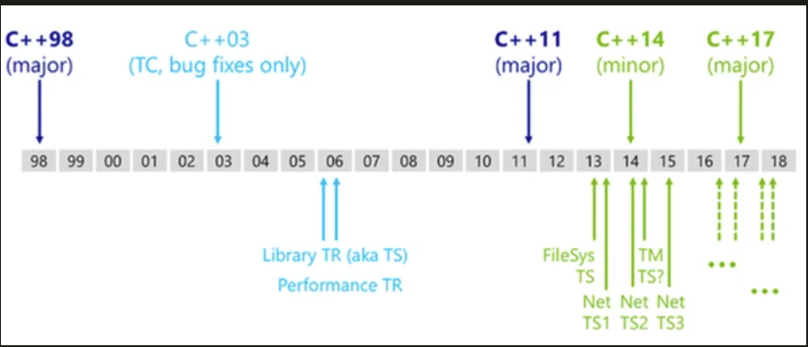

## A Summary of New Features in C++11, C++14, C++17, and C++20

The history of C++ can be traced back to 1979, when Bjarne Stroustrup (the father of C++, hereinafter referred to as Stroustrup) was working with the Simula language.

Simula is considered the first object-oriented programming language. Stroustrup greatly appreciated this feature of Simula. However, due to its low execution efficiency in practical development, he soon began working on a "C with Classes" programming language.

> Note that in the early stages of development, there was no such name as C++. "C with Classes," as the name suggests, was based on the C language and incorporated object-oriented concepts (by adding some pre-written classes and objects). In addition to all the features of C, early C++ had simple features such as classes, basic inheritance, inline functions, default function parameters, and strong type checking.

Moreover, Stroustrup developed a compiler specifically for "C with Classes" based on CPre (C language compiler), called Cfront. It could automatically convert C code with classes into ordinary C language programs. It is worth mentioning that Cfront was deprecated in 1993 due to difficulties in supporting the C++ exception mechanism.

In 1983, "C with Classes" was officially named "C++," where "++" comes from the "++" operator in C. This also reflects Stroustrup's positioning of C++ as a programming language. At the same time, C++ added many features, such as virtual functions, function overloading, references, the `const` keyword, and the `//` comment symbol.

> In the following years, C++ developed rapidly. For example, C++ was constantly updated, with protected and private members added to classes, and multiple inheritance allowed. Stroustrup published "The Annotated C++ Reference Manual," which was once regarded as an important reference for C++ development. Borland released the Turbo C++ compiler, which included a large number of third-party C++ libraries, greatly facilitating C++ development.

It wasn't until 1998 that the C++ Standards Committee released the first C++ standard, named C++98. According to unknown sources, "The Annotated C++ Reference Manual" had a significant impact on the formulation of the C++98 standard.

Through continuous iteration by the author, a book often has many versions released, each a revision and update of the previous one. The development of the C++ programming language is no different. As of 2020, C++ has gone through the following three standards:

- In 2011, the new C++11 standard was born to replace the C++98 standard. This standard also has an alias, "C++0x."
- In 2014, the C++14 standard was released, which made better modifications and updates to the C++11 standard library.
- At the end of 2017, the C++17 standard was officially released.

> The standard defines the coding specifications for C++ code, which all C++ programmers should follow.

It is worth mentioning that before the C++11 standard, the C++ Standards Committee also made a revision to the C++98 standard in 2003 (called the C++03 standard). However, because it only fixed some loopholes in the C++98 standard and did not modify the core syntax, people are accustomed to referring to this revision and C++98 together as the C++98/03 standard.

Among the above three standards, the C++11 standard is undoubtedly revolutionary in terms of modifications and updates compared to the previous version. This standard fixed about 600 defects in the C++ language based on C++98 and added about 140 new features. These updates have given C++ a new lease on life. Readers can understand the C++11 standard as giving birth to a brand new C++ programming language based on the C++98/03 standard, creating a new beginning for C++.

## C++11

### [auto Type Deduction](C++11/autoTypeDeduction.md)

### [decltype Type Deduction](C++11/decltypeTypeDeduction.md)

### [Summary of Differences Between auto and decltype](C++11/autoORdecltype.md)

### [Trailing Return Types (Deduced Return Types)](C++11/TrailingReturnType.md)

### [Improved Handling of Consecutive Closing Angle Brackets (>>) in Template Instantiation](C++11/ConsecutiveAngleBrackets.md)

### [Using using for Alias Declarations (Replacing typedef)](C++11/using.md)

### [Default Template Arguments for Function Templates](C++11/DefaultTemplate.md)

### [Variadic Templates and Functions](C++11/Variadic.md)

### [The tuple Class Template](C++11/tuple.md)

### [List Initialization (Unified Initialization)](C++11/ListInitialization.md)

### [Lambda Expressions](C++11/LambdaExpressions.md)

### [Unrestricted Unions](C++11/UnrestrictedUnions.md)

### [Range-Based for Loops](C++11/forLoop.md)

### [Range-Based for Loop Considerations](C++11/forLoopCautions.md)

### [constexpr: Verifying Constant Expressions](C++11/constexpr.md)

### [constexpr vs. const: Distinguishing the Differences](C++11/constexprVsconst.md)

### [long long: Extended Integer Type](C++11/longlong.md)

### [Rvalue References](C++11/RvalueReferences.md)

### [Move Constructors](C++11/MoveConstructors.md)